# Template for a blog website

Created as a task for WBS Primer Course.

This project was created with Parcel. For familiarization and setting additional
features [refer to documentation](https://parceljs.org/).

Fake backend created via [app.beeceptor.com](https://app.beeceptor.com/).

**Attention!** Due to the fact that the free version of the backend Beeceptor
has a daily limit of 50 requests per day, if the limit is exceeded, the alert
message will be shown.

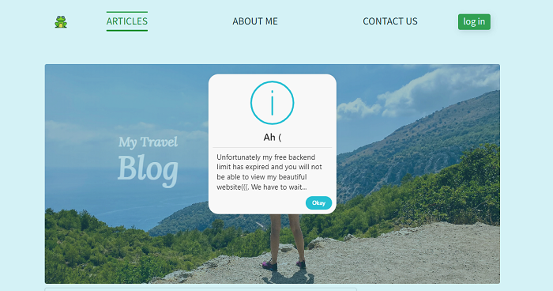

## Description and features of the website

1. Website designed for different screen widths with breakpoints at 480 px, 768
   px, 1200 px.
2. The Website has some pages:

   - index.html (a page on which the user can see previews of articles),
   - about-page.html (a page on which the user can read information about a
     website, author, or other information),
   - contact-page.html (the page on which the user can send a message),

**contact-page**

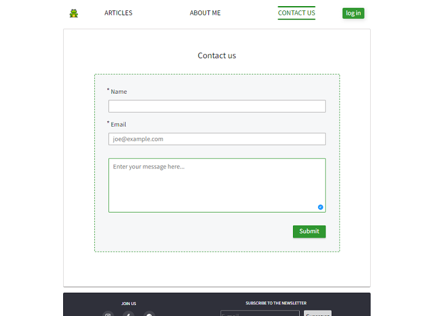

- article-page.html (a page on which the user can see the entire article,
  comments on the article, and also leave a comment),

  Going to the page of one article occurs by pressing a button _read more_.

**read more button**

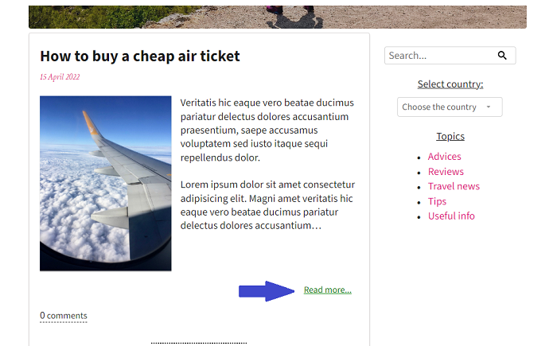

Returning to the page occurs by pressing a button _Go to articles_.

**Go to articles**

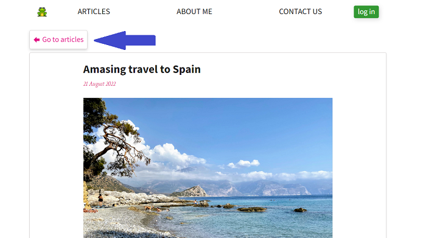

Clicking on the comment input element opens the full comment section.

**comment input element**

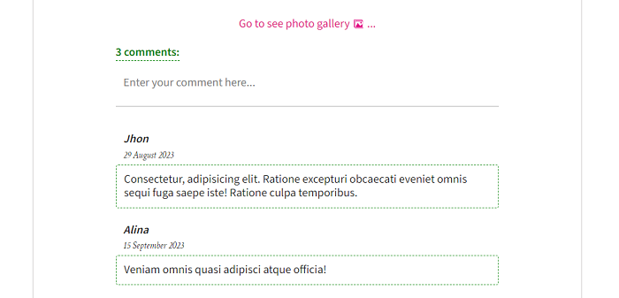

**comment section**

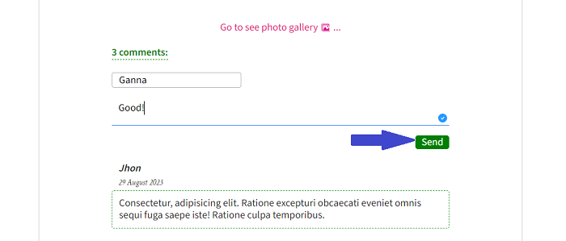

- registration/login modal window.

**modal window mobile screen**

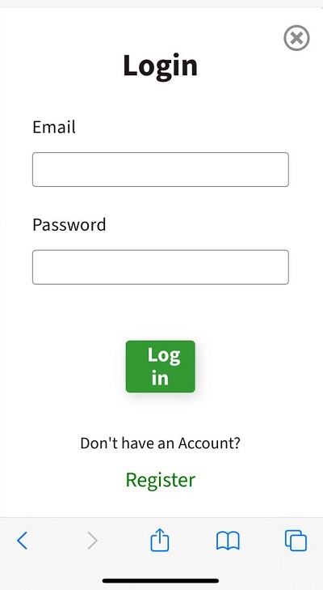

**modal window desctop screen**

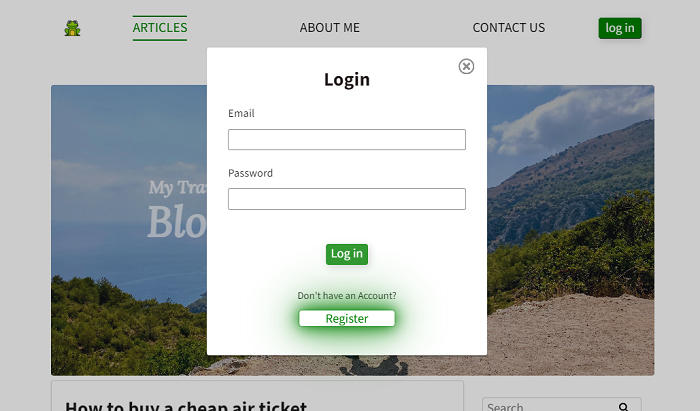

3. The header implements navigation across website pages. The current page is
   highlighted and underlined (in the desktop version).

**navigation mobile screen**

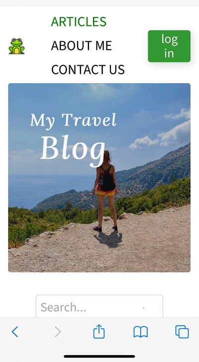

**navigation desctop screen**

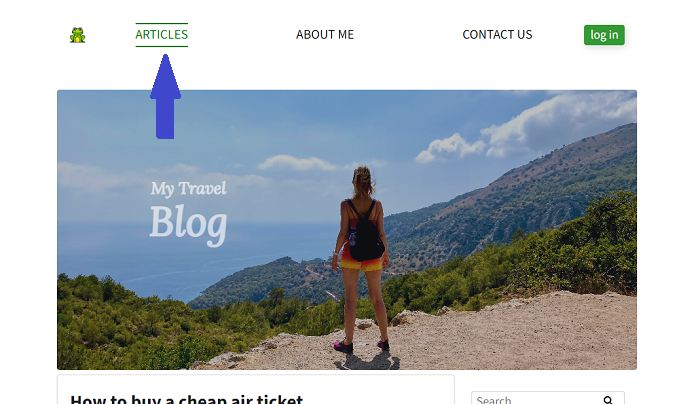

4. On the index page, there are options for filtering articles by tag in the
   topic section or country in the drop-down menu.

**filtering articles mobile screen**

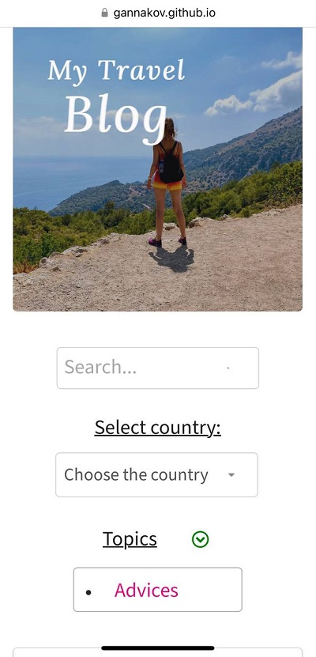

**filtering articles by tag desctop screen**

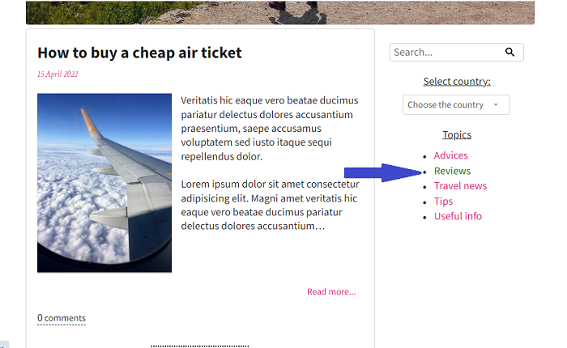

In the mobile version, navigation by tags can be done by scrolling or by opening
the entire list by clicking the icon.

**filtering articles by tag mobile screen**

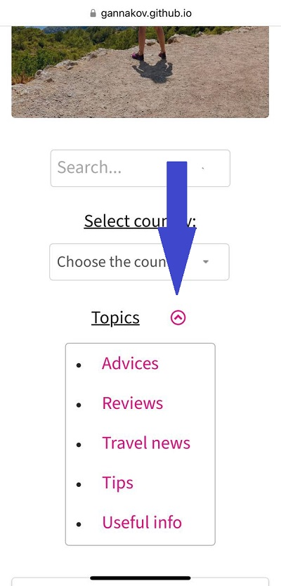

**filtering articles by country desctop screen**

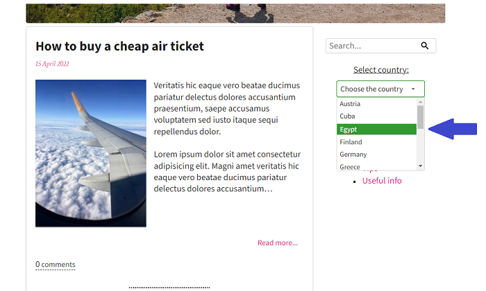

**filtering articles by country mobile screen**

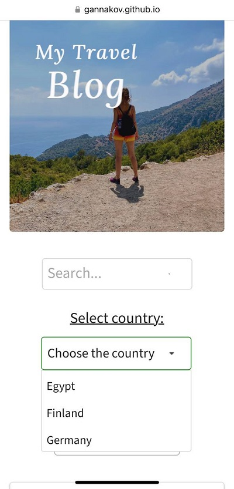

5. In the footer there is an opportunity to go to social media pages and
   subscribe to the newsletter.

**footer section**

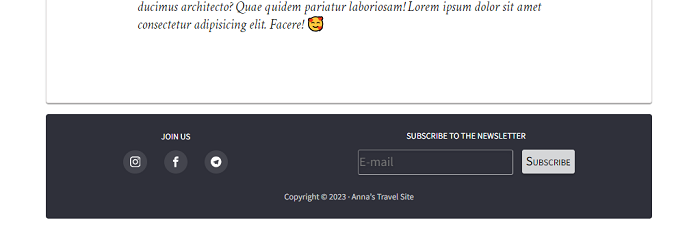

## Technologies Used

- [JavaScript](https://developer.mozilla.org/en-US/docs/Web/JavaScript)
- [SCSS](https://sass-lang.com/documentation/)
- [HTML](https://developer.mozilla.org/en-US/docs/Web/HTML)

## Installing and launching the app

1. Make sure you have an LTS version of Node.js installed on your computer.
   [Download and install](https://nodejs.org/en/) if needed.
2. Install the project's base dependencies with the `npm install` command.
3. Start development mode by running the `npm start` command.
4. Go to [http://localhost:1234](http://localhost:1234) in your browser. This
   page will automatically reload after saving changes to the project files.

## Files and folders

- All stylesheet parshas should be in the `src/sass` folder and imported into
  the page stylesheets. For example, for `index.html` the style file is named
  `index.scss`.
- Add images to the `src/images` folder. The assembler optimizes them, but only
  when deploying the production version of the project. All this happens in the
  cloud so as not to burden your computer, as it can take a long time on weak
  machines.
- All js parshas should be in the `src/js` folder and imported into the page js
  file. For example, for `index.html` the file is named `index.js`.

## Deploy

To set up a project deployment, you need to perform a few additional steps to
set up your repository. Go to the `Settings` tab and in the `Actions` subsection
select the `General` item.


Scroll the page to the last section, in which make sure the options are selected
as in the following image and click `Save`. Without these settings, the build
will not have enough rights to automate the deployment process.


The production version of the project will be automatically built and deployed
to GitHub Pages, in the `gh-pages` branch, every time the `main` branch is
updated. For example, after a direct push or an accepted pull request. To do
this, you need to edit the `homepage` field and the `build` script in the
`package.json` file, replacing `your_username` and `your_repo_name` with your
own, and submit the changes to GitHub.

```json
"homepage": "https://your_username.github.io/your_repo_name/",
"scripts": {
  "build": "parcel build src/*.html --public-url /your_repo_name/"
},
```

Next, you need to go to the settings of the GitHub repository (`Settings` >
`Pages`) and set the distribution of the production version of files from the
`/root` folder of the `gh-pages` branch, if this was not done automatically.

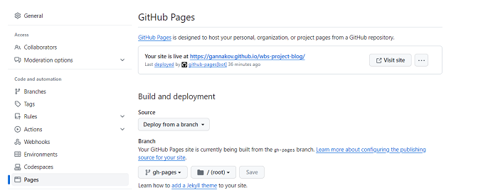

### Deployment status

The deployment status of the latest commit is displayed with an icon next to its
ID.

- **Yellow color** - the project is being built and deployed.
- **Green color** - deployment completed successfully.
- **Red color** - an error occurred during linting, build or deployment.

More detailed information about the status can be viewed by clicking on the
icon, and in the drop-down window, follow the link `Details`.

### Live page

Live page can be accessed at
<https://gannakov.github.io/wbs-project-blog/index.html>.
